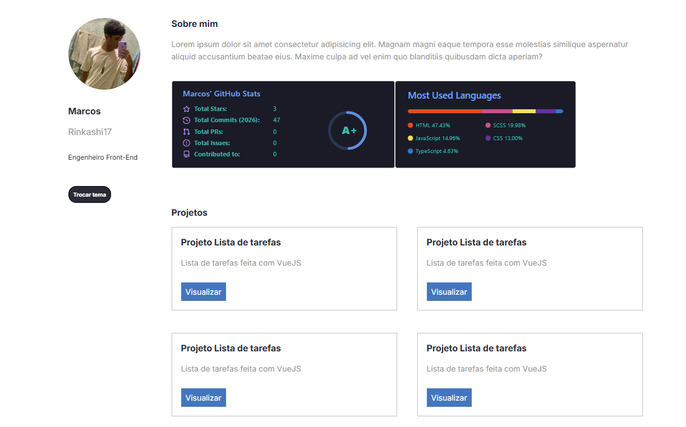

<h1 align="center">
  Portfolio em React
</h1>

<div align="center">
  
</div>

# ⚛️ Portfólio em React + TypeScript

Este é um projeto de portfólio desenvolvido com tecnologias modernas de front-end. O objetivo é criar uma aplicação robusta, tipada e de fácil manutenção para exibir projetos e informações profissionais.

## 🛠️ Tecnologias Utilizadas
- **React**: Biblioteca principal para construção da interface.
- **TypeScript**: Adição de tipagem estática para maior segurança e produtividade.
- **ESLint & Prettier**: Padronização de código e formatação automática.
- **CSS**: Estilização dos componentes (configurado via Create React App).

## 🚀 Funcionalidades do Projeto
- Estrutura baseada em **Componentes**.
- Tipagem de interfaces e props com **TypeScript**.
- Ambiente de desenvolvimento configurado para boas práticas.

## 📁 Estrutura de Pastas
```text
├── src/
│   ├── components/    # Componentes reutilizáveis
│   ├── assets/        # Imagens e arquivos estáticos
│   ├── App.tsx        # Componente principal
│   └── index.tsx      # Ponto de entrada da aplicação
├── public/            # Arquivos públicos (index.html, manifest)
├── tsconfig.json      # Configurações do TypeScript
└── .eslintrc.json     # Regras de linting
⚙️ Como executar o projeto
Clone o repositório:

Bash
git clone [https://github.com/Rinkashi17/aula-portfolio.git](https://github.com/Rinkashi17/aula-portfolio.git)
Instale as dependências:

Bash
npm install
Inicie o servidor de desenvolvimento:

Bash
npm start
Acesse http://localhost:3000 no seu navegador.

🧹 Padronização de Código
O projeto utiliza ferramentas para manter o código limpo:

npm run lint: Verifica erros de linting.

O Prettier está configurado para formatar o código ao salvar.

Desenvolvido por Rinkashi17
